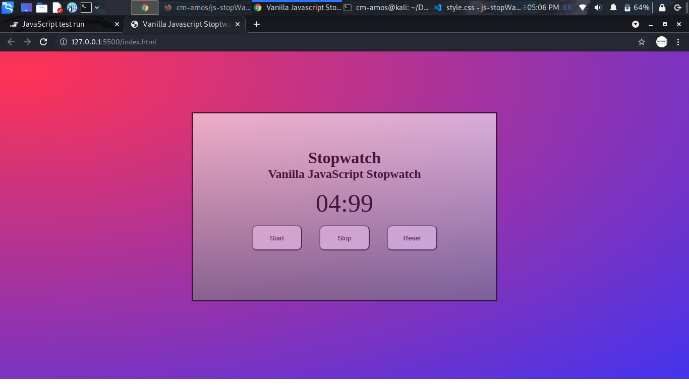

<h1>Vanilla Javascript StopWatch</h1>
This project basically has three files <pre>index.html,style.css and behavior.js</pre>They make a simple functional stopwatch. 
I implemented concepts of in linear gradient(css),setinterval(js),clearInterval(js) and arrow functions(js) and HTML 
Here is a copy of how the StopWatch looks like. 
 

